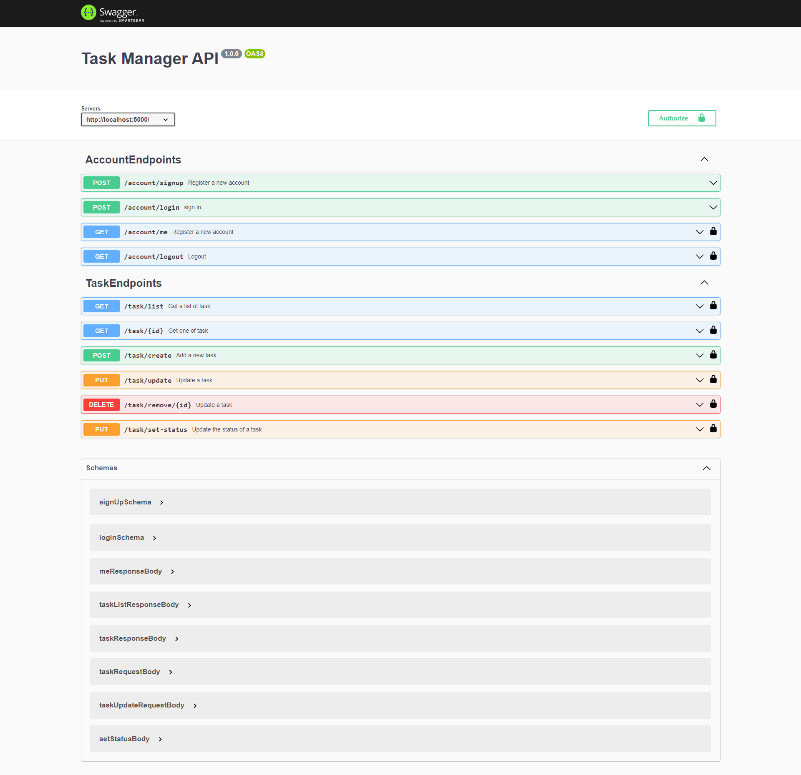

## Task Manager Api

### Summary
<hr>

This is an minimal class based API created in nodeJS (typeScript) using a controller model for routes and a repository pattern for isolated logic handling.

For the implementation of this model the package node-controller is used, which is an npm package that allows you to use the necessary decorators to easily implement class-based routes.


### How to run it
<hr>
Build and run the image with docker-compose commands:

 - `docker-compose build`
 - `docker-compose up`

Once the image is running, go to http://localhost:5000

**note**: To login into the API, use the default User credentials.

```Javascript
    email: "default@user.com"
    password: "pa$$w0rd"
```

